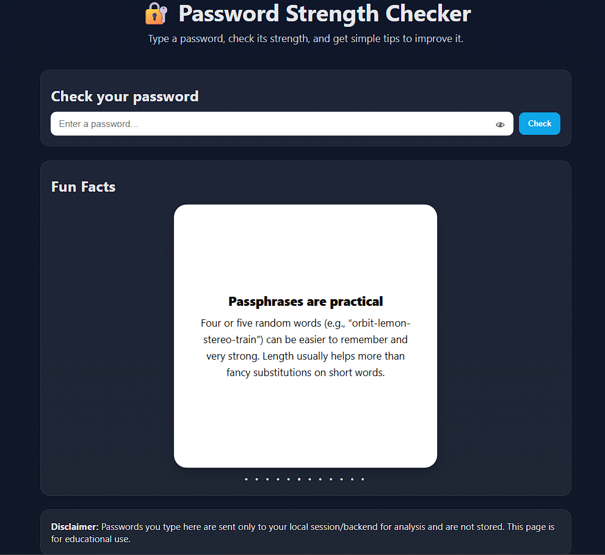
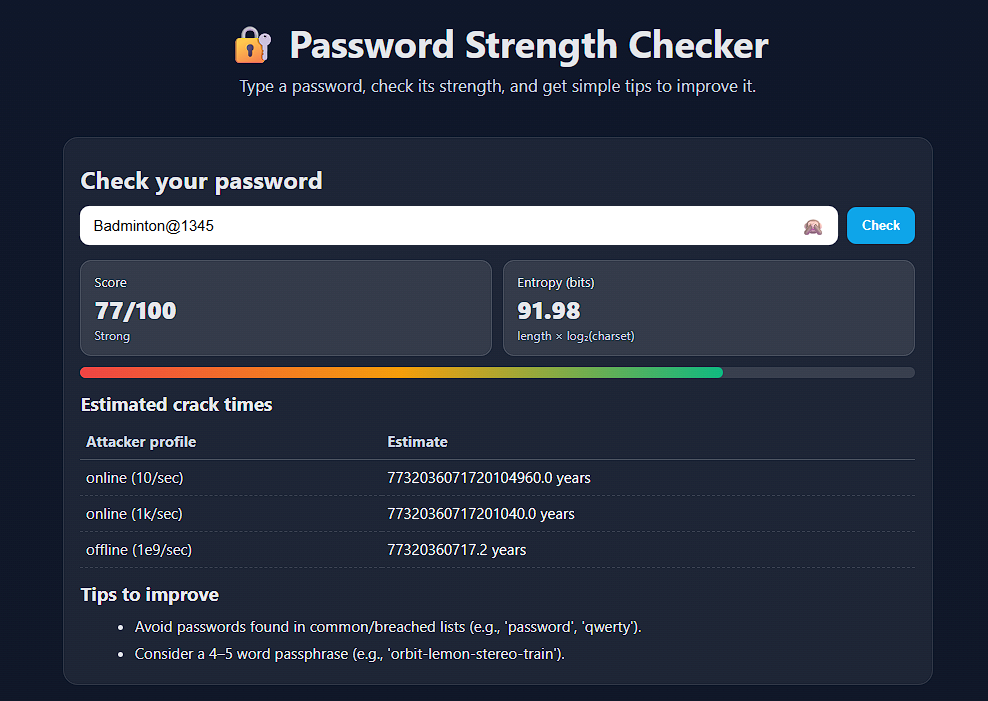

# 🔐 Password Analyzer with Fun Facts

A simple yet educational web application that allows users to **check the strength of their passwords** and learn **cybersecurity fun facts** in the process.  
Built using **Python (Flask)** for the backend and **HTML, CSS, and JavaScript** for the frontend.

---

## 📸 Screenshots

### Landing Page


### Password Analysis


---

## ✨ Features

- **Password Strength Analysis**: Checks length, complexity, common words, and more.
- **Estimated Crack Time**: Shows how long it might take to crack the password.
- **Improvement Tips**: Gives personalized suggestions to make passwords stronger.
- **Fun Facts Section**: Displays random cybersecurity facts every 4 seconds.
- **Eye Button**: Toggle password visibility when typing.
- **Privacy Notice**: Passwords are never stored — analysis happens in your session only.

---


---

## 🛠️ Tech Stack

**Frontend:**
- HTML, CSS, JavaScript

**Backend:**
- Python 3(Flask Framework)

**Other:**
- Vercel for deployment
- `requirements.txt` for dependency management

---

## 📂 Project Structure

password-analyzer/
│
├── screenshots/ # Project screenshots
| ├── landing.png
| └── analysis.png
|
├── static/
│ ├── style.css # Frontend styles
│ └── script.js # Frontend JavaScript
│
├── templates/
│ └── index.html # Landing page
│
├── app.py # Flask backend
├── common_words_list.py # Common words for password check
├── fun_facts_list.py # List of fun facts
├── password_analyzer.py # Password analysis logic
├── requirements.txt # Python dependencies
├── vercel.json # Vercel deployment configuration

---

## ⚡ Getting Started

### 1️⃣ Clone the Repository
```bash
git clone https://github.com/yourusername/password-analyzer.git
cd password-analyzer
```

### 2️⃣ Install Dependencies
```bash
pip install -r requirements.txt
```

3️⃣ Run the Application or visit [checkmypass.vercel.app](url)
```bash
python app.py
```

## ⚠️ Disclaimer

This application is intended **solely for educational and demonstration purposes**.

- **No Password Storage**: All password checks are processed locally on the server during your active session. No passwords are stored, saved, or logged.
- **Privacy First**: We do not track, share, or transmit any data you enter. The analysis happens in-memory and is discarded immediately after processing.
- **Do Not Use Real Credentials**: For your own safety, please do not test this tool using passwords you actively use for banking, email, or other personal accounts.
- **No Security Guarantee**: While the password strength estimates are based on common security heuristics, they are not a substitute for professional security auditing.

By using this application, you acknowledge and agree that:
> The authors and contributors are **not responsible** for any damages, losses, or consequences resulting from the use or misuse of this tool.

